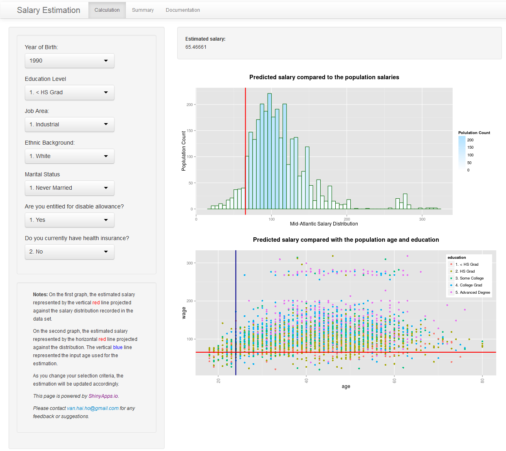

## What is in SEA for me?

<ul>
<li> Everyone wants to know what you earn is in reasonable range </li>
<li> No one wants to get pay less than what you are entitled to </li>
<li> How to find out the market range? </li>
<li> What factors that might influence my remuneration? </li>
<li> Knowing the market will give you more power to negotiate your remuneration</li>
</ul>

=> SEA provides you a facility to quickly find out your worths in the market, and
<br>
=> enables you to easily manipulate and explore different options.

--- .class #id 

## What does SEA do? - On Server side

- SEA uses <code>Wage</code> data set from <code>ISLR</code> package for training.
- The data set contains 3000 observations with 12 variables:
```{r dataset, cache=TRUE}
library(ISLR); data(Wage); names(Wage)
```

- Excluded variables that are not helpful for the model:
  + `sex`, `region`: contains of single value, resulting in constance variance
  + `logwage`: calculated value for the recorded wages in the data set.

---

## What does SEA do? (cont.)

- SEA uses Linear Regression model to analyse the common variables collected in <code>Wage</code> data set: *Year of Birth*, *Education Level*, *Job Area*, *Ethnic Background*, *Marital Status*, and *Health*.
```{r train, echo=FALSE, message=FALSE, cache=TRUE}
# This block of code is needed to train the model in order to run prediction in the next one.
# Get current year
currentYear <- as.numeric(format(Sys.Date(), "%Y"))
years <- c(1900:currentYear)
educationLevels <- as.character(sort(unique(Wage$education)))
jobClass <- as.character(sort(unique(Wage$jobclass)))
raceGroups <- as.character(sort(unique(Wage$race)))
maritalStatus <- as.character(sort(unique(Wage$maritl)))
Wage$health <- factor(Wage$health, labels = c("1. Yes", "2. No"))
healthStatus <- as.character(sort(unique(Wage$health)))
healthInsStatus <- as.character(sort(unique(Wage$health_ins)))
# testCase 
testCase <- list(year = currentYear,
                 age = currentYear - years[91],
                 education = educationLevels[1],
                 jobclass = jobClass[1],
                 race = raceGroups[1],
                 maritl = maritalStatus[1],
                 health = healthStatus[1],
                 health_ins = healthInsStatus[1])

trainModel <- function(trainMethod = "glm") {
    #modelFile <- "wageGlm.RData"
    modelFile <- "wageLm.RData"
    if (file.exists(modelFile)) {
        # load the model previously built
        load(modelFile)
    } else {
        # there is no model, build it now
        # Exclude sex and region as these variables only 1 single value
        # Exclude logwage as this is a calculated log wage
        Wage <- subset(Wage, select = -c(sex, region, logwage))
        
        # Fit Linear Regression Model onto the data set
        wageModel <- glm(wage ~ year + age + maritl + race + education + jobclass + health + health_ins, 
                     data = Wage)
        
        # Save this model
        save(wageModel, file = modelFile)
    }
    wageModel
}

wageModel <- trainModel()
```

```{r trainStatement, echo=TRUE, eval=FALSE}
# Fit Linear Regression Model 
wageModel <- glm(wage ~ year + age + maritl + race + education + jobclass + health + health_ins, data = Wage)
```

- User Interfaces: [Shiny](http://shiny.rstudio.com/) is used to build SEA to enable instantly reactivity to user interactions.
- As a value of one of the above features changed, SEA will try to predict the salary level again:

```{r predict, cache=TRUE}
predict(wageModel, testCase)
```

- SEA is hosted on [ShinyApps.io](http://www.shinyapps.io).
- Documentations are also available with the links on the applications.

---

## SEA in Action

Access SEA: <http://vanhaiho.shinyapps.io/ddp_shiny_project/>
<div style='text-align: center;'>
    
</div>


